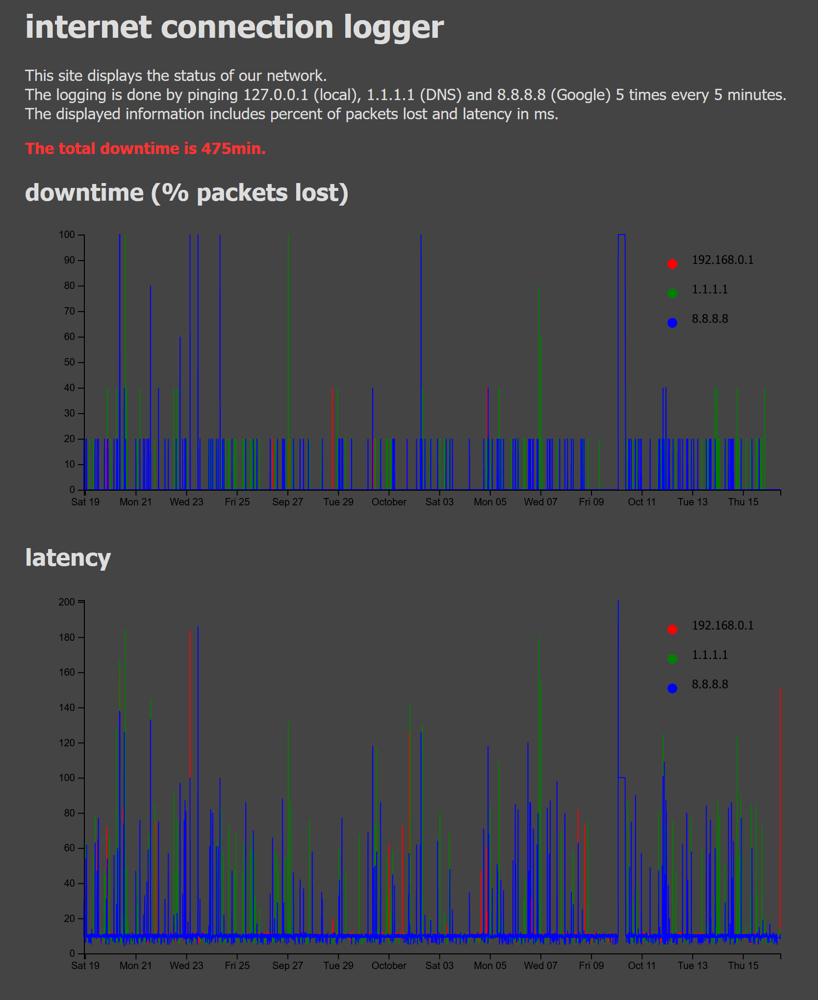

# network_availability_logger
log network availability by pinging servers every 5 minutes and display past status on a web page with d3

to setup the logger first copy the folder "ping_log" with script "connectivity.sh" and an empty "ping_log.csv" file (the included data is an example on how the data is logged). \
then let a cronjob execute the script every 5min by typing:
```
crontab -e
```
and adding:
```
*/5 * * * * /var/www/html/ping_log/connectivity.sh
```
then add the web page "ping.php" in the appropriate folder for your web server change the path to the "ping_log.csv" file accordingly

the web page looks this way:
